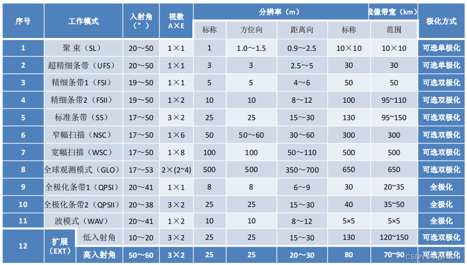

# PatchMaker

PatchMaker 是一个遥感影像处理工具套件，包含Python和IDL两个部分。Python部分专注于多源遥感数据的裁剪、合并和地理信息提取；IDL部分（原IDL_GeoProcessingSuite）则专注于高分三号（GF3）数据处理。该套件支持多类型遥感数据的联合处理，提供一系列用于数据准备、处理和分析的实用工具。



## 项目结构

该项目分为 **Python** 和 **IDL** 两个主要部分：

## Python 部分

Python部分分为根目录和 **Unit** 目录两个主要部分：

### 根目录
包含集成模块和高级功能脚本：

1. **Reads.py**  
   影像边界读取脚本，用于从 TIF 文件中提取地理边界并生成 GeoJSON 文件。

2. **ReadTimes.py**  
   时间信息提取脚本，可从文件夹名称中提取日期信息并与 TIF 文件匹配。

3. **Cuts.py**  
   多影像裁剪脚本，用于处理多个文件夹中的匹配影像，提取共同区域并生成裁剪后的 TIF 文件。

### Unit 目录
包含基础功能模块，实现核心影像处理功能：

1. **Cut.py**  
   基础裁剪脚本，用于裁剪两幅影像的重叠区域。

2. **CutGeoJson.py**  
   GeoJSON 分割脚本，将大区域 GeoJSON 分割为四个子区域。

3. **MergeTiff.py**  
   影像合并脚本，将多个分块 TIF 文件合并为单一 TIF 文件。

4. **ReadAndCut.py**  
   读取与裁剪联合脚本，基于参考影像有效区域裁剪目标影像。

5. **Read.py**  
   基础数据读取脚本，提供了影像读取和基础信息提取功能。

6. **ListDir.py**  
   目录遍历脚本，用于列出并处理特定目录中的文件。

## IDL 部分

主要用于高分三号（GF3）数据处理，分为 **Unit** 和 **Integration** 两个部分：

### IDL/Unit 文件夹
单元模块，负责实现数据处理的核心功能，包括以下脚本（按执行顺序）：
1. **GF3_Import_Process.pro**  
   导入高分三号数据的脚本，用于加载并预处理数据。

2. **GF3_Filter_Process.pro**  
   数据过滤与增强脚本，用于对高分三号数据进行去噪和增强。

3. **Geocoding_Process.pro**  
   地理编码脚本，用于将数据映射到地理坐标系。

4. **Generate_Meta_From_DB_With_Dimensions.pro**  
   Meta 文件生成脚本，从数据文件中提取维度和其他元信息，生成 meta 文件。

5. **Generate_DEM.pro**  
   数字高程模型（DEM）生成脚本，从影像中提取高程信息。

6. **Export_Meta_To_TIFF.pro**  
   数据导出脚本，将处理后的数据和 meta 信息导出为 TIFF 格式文件。

7. **GF3_Multilooking_Process.pro**  
   多视处理脚本，用于提升图像质量或合成多个视角的数据。

### IDL/Integration 文件夹
集成模块，整合 Unit 中的单元模块，完成完整数据处理流程：
1. **GF3_Pipeline_Process.pro**  
   高分三号数据处理管道脚本，串联多个单元模块，实现完整的自动化数据处理流程。

2. **GF3_One_Process.pro**  
   单次处理脚本，用于调试或快速执行单个完整操作。

## 功能特点

### Python 特点
- **多源影像处理**：支持光学和 SAR 遥感影像的联合处理和分析
- **影像裁剪**：基于重叠区域进行精确裁剪，保证空间一致性
- **地理信息提取**：从影像中提取地理边界并转换为标准 GeoJSON 格式
- **时间信息匹配**：从文件夹名称中提取时间信息并与影像文件匹配
- **影像合并**：将分块处理的影像无缝合并为完整影像
- **区域分割**：将大区域 GeoJSON 分割为子区域，便于分块处理

### IDL 特点
- **高分三号数据处理**：专为高分三号卫星数据设计的处理流程
- **多视处理**：提供多视合成功能，提升图像质量
- **单通道强度数据滤波**：针对雷达数据的滤波处理
- **地理编码与辐射定标**：确保数据的地理准确性和辐射校正
- **完整处理流程**：从数据导入到导出的全流程处理能力

## 使用说明

### Python 环境要求
- Python 3.13

### IDL 环境要求
- IDL 环境（建议版本：8.8 或 9.1）
- ENVI 软件（建议版本：5.6 或 6.1）
- 高分三号数据文件

### 快速开始

#### Python 部分
1. 克隆本项目到本地并安装依赖：
   ```bash
   git clone https://github.com/Mriris/PatchMaker.git
   pip install -r Python/requirements.txt
   ```

2. 根据需要修改脚本中的文件路径：
   - 打开相应脚本，修改 `input_dir` 和 `output_dir` 变量为实际路径

3. 执行特定功能：
   - 裁剪两幅影像的重叠区域：
     ```bash
     python Python/Unit/Cut.py
     ```
   - 基于多源影像进行裁剪：
     ```bash
     python Python/Cuts.py
     ```
   - 提取影像边界为 GeoJSON：
     ```bash
     python Python/Reads.py
     ```

#### IDL 部分
1. 在 IDL 环境中加载并运行需要的脚本：
   - 单独测试某一功能时，可加载 IDL/Unit 文件夹中的脚本。
   - 执行完整流程时，可加载 IDL/Integration 文件夹中的脚本。

2. 执行完整流程示例：
   ```idl
   .compile 'GF3_Pipeline_Process.pro'
   GF3_Pipeline_Process
   ```

## 数据处理流程示例

### Python 处理流程

#### 影像裁剪流程
1. 读取光学和 SAR 影像
2. 提取有效像素区域并转换为几何对象
3. 计算两幅影像的重叠区域
4. 基于重叠区域裁剪两幅影像
5. 更新元数据并保存裁剪结果

#### GeoJSON 分割流程
1. 读取原始 GeoJSON 文件
2. 获取多边形边界框和中心点
3. 创建四个子多边形（左上、右上、左下、右下）
4. 将每个子多边形保存为独立的 GeoJSON 文件

#### 时间信息提取流程
1. 遍历 TIF 文件目录
2. 从文件名中提取标识信息
3. 搜索目标文件夹中的匹配子文件夹
4. 从子文件夹名中提取日期信息
5. 输出 TIF 文件与对应日期的匹配关系

### IDL 处理公式和算法

#### UTM Zone 计算公式
在高分三号数据处理中，UTM Zone（UTM 区号）是根据数据集文件夹名中的经度信息来计算的。

1. **解析文件夹名中的经度信息**  
   文件夹名格式通常包含经度信息，计算 UTM Zone 需要从文件夹名中提取该经度。文件夹名的第四部分包含经度信息，我们首先提取该部分，然后去掉首字母。

2. **UTM Zone 计算公式**  
   UTM Zone 是根据经度值来确定的，具体计算公式为：

```math
\text{UTM Zone} = \left\lfloor \frac{\text{longitude}}{6} \right\rfloor + 31
```

- 经度是文件夹名中提取的经度值
- $\left\lfloor x \right\rfloor$ 表示向下取整（整数部分）
- $31$ 是加上的基准值，用于确定起始区号
   
#### 多视因子计算公式
在高分三号数据处理中的 **多视因子** 计算是为了进行图像处理中的 **多视合成**，这通常用于提升图像质量或处理雷达图像的分辨率。

1. **地面分辨率**  
   地面分辨率计算公式为：

```math
\text{ground\_resolution} = \frac{\text{pixel\_spacing\_rg}}{\sin \left( \frac{\pi \cdot \text{incidence\_angle}}{180} \right)}
```

   - `pixel_spacing_rg` 是雷达方向的像素间距
   - `incidence_angle` 是入射角度，单位为度
   - $\sin$ 是正弦函数

2. **Range 多视因子**  
   Range 多视因子计算公式为：

```math
\text{range\_multilook} = \lceil \frac{\text{ground\_resolution}}{\text{pixel\_spacing\_rg}} \rceil
```

   - `pixel_spacing_rg` 是雷达方向上的像素间距
   - $\lceil x \rceil$ 表示向上取整

3. **Azimuth 多视因子**  
   Azimuth 多视因子计算公式为：

```math
\text{azimuth\_multilook} = \lceil \frac{\text{ground\_resolution}}{\text{pixel\_spacing\_az}} \rceil
```

   - `pixel_spacing_az` 是方位方向上的像素间距

## 参考资料

### Python 参考资料
- [Rasterio 文档](https://rasterio.readthedocs.io/)
- [Shapely 文档](https://shapely.readthedocs.io/)
- [GeoPandas 文档](https://geopandas.org/)

### IDL 参考资料
- [IDL String 方法](https://envi.geoscene.cn/help/Subsystems/idl/Content/Reference%20Material/Static%20Methods/IDL_String.htm)
- [IDL String Split](https://envi.geoscene.cn/help/Subsystems/idl/Content/Reference%20Material/Static%20Methods/IDL_String.htm#Split)
- [CSDN 博客文章](https://blog.csdn.net/m0_66892427/article/details/134902918)

### 本地 ENVI 安装帮助文件  
以下路径为 ENVI 软件本地帮助文档路径，仅在安装 ENVI 软件后可用：  

- **SARscape 多视处理**：  
  `file:///D:/Application/Harris/SARscape/auxiliary/envi_extensions/idl/help/SARscape/multilooking.htm`  
- **SARscape 多视任务处理**：  
  `file:///D:/Application/Harris/SARscape/auxiliary/envi_extensions/idl/help/SARscape/sarmap_task_multilooking.htm`  
- **GMTED2010 概述**：  
  `file:///D:/Application/Harris/ENVI56/IDL88/help/online_help/Subsystems/envi/Content/GeorectifyImagery/GMTED2010Overview.htm`  
- **ENVI 扩展任务导出 TIFF**：  
  `file:///D:/Application/Harris/ENVI56/IDL88/help/online_help/Subsystems/envi/Content/ExtendCustomize/ENVITasks/ENVIExportRasterToTIFFTask.htm`  
- **ENVI OpenRaster 文档**：  
  `file:///D:/Application/Harris/ENVI56/IDL88/help/online_help/help.htm#search-OpenRaster`  
- **ENVI Raster 文档**：  
  `file:///D:/Application/Harris/ENVI56/IDL88/help/online_help/Subsystems/envi/Content/ExtendCustomize/ENVIRaster/enviRaster.htm` 