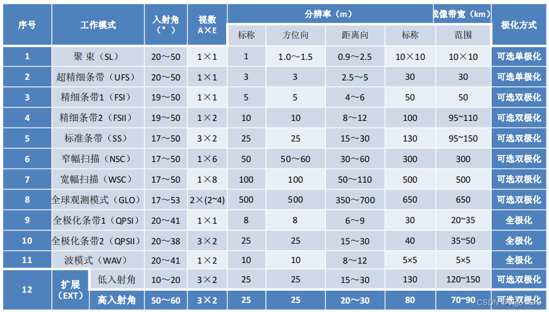

# IDL_GeoProcessingSuite
IDL_GeoProcessingSuite 是一个使用 IDL 编程语言开发的高分三号（GF3）数据处理脚本套件，包含数据导入、多视处理、单通道强度数据滤波、地理编码和辐射定标、导出模块，支持部分高分三号数据处理流程。



## 项目结构

该项目分为 **Unit** 和 **Integration** 两个部分：

### Unit 文件夹
单元模块，负责实现数据处理的核心功能，包括以下脚本（按执行顺序）：
1. **GF3_Import_Process.pro**  
   导入高分三号数据的脚本，用于加载并预处理数据。

2. **GF3_Filter_Process.pro**  
   数据过滤与增强脚本，用于对高分三号数据进行去噪和增强。

3. **Geocoding_Process.pro**  
   地理编码脚本，用于将数据映射到地理坐标系。

4. **Generate_Meta_From_DB_With_Dimensions.pro**  
   Meta 文件生成脚本，从数据文件中提取维度和其他元信息，生成 meta 文件。

5. **Generate_DEM.pro**  
   数字高程模型（DEM）生成脚本，从影像中提取高程信息。

6. **Export_Meta_To_TIFF.pro**  
   数据导出脚本，将处理后的数据和 meta 信息导出为 TIFF 格式文件。

7. **GF3_Multilooking_Process.pro**  
   多视处理脚本，用于提升图像质量或合成多个视角的数据。

### Integration 文件夹
集成模块，整合 Unit 中的单元模块，完成完整数据处理流程：
1. **GF3_Pipeline_Process.pro**  
   高分三号数据处理管道脚本，串联多个单元模块，实现完整的自动化数据处理流程。

2. **GF3_One_Process.pro**  
   单次处理脚本，用于调试或快速执行单个完整操作。

## 使用说明

### 环境要求
- IDL 环境（建议版本：8.8）
- ENVI 软件（建议版本：5.6）
- 高分三号数据文件

### 快速开始
1. 克隆本项目到本地：
   ```bash
   git clone git@github.com:Mriris/IDL_GeoProcessingSuite.git
   ```
2. 在 IDL 环境中加载并运行需要的脚本：
   - 单独测试某一功能时，可加载 Unit 文件夹中的脚本。
   - 执行完整流程时，可加载 Integration 文件夹中的脚本。

3. 执行完整流程示例：
   ```idl
   .compile 'GF3_Pipeline_Process.pro'
   GF3_Pipeline_Process
   ```
### UTM Zone 计算公式
在高分三号数据处理中，UTM Zone（UTM 区号）是根据数据集文件夹名中的经度信息来计算的。

1. **解析文件夹名中的经度信息**  
   文件夹名格式通常包含经度信息，计算 UTM Zone 需要从文件夹名中提取该经度。文件夹名的第四部分包含经度信息，我们首先提取该部分，然后去掉首字母。

2. **UTM Zone 计算公式**  
   UTM Zone 是根据经度值来确定的，具体计算公式为：

```math
\text{UTM Zone} = \left\lfloor \frac{\text{longitude}}{6} \right\rfloor + 31
```

- 经度是文件夹名中提取的经度值
- $\left\lfloor x \right\rfloor$ 表示向下取整（整数部分）
- $31$ 是加上的基准值，用于确定起始区号
   
### 多视因子计算公式
在高分三号数据处理中的 **多视因子** 计算是为了进行图像处理中的 **多视合成**，这通常用于提升图像质量或处理雷达图像的分辨率。

1. **地面分辨率**  
   地面分辨率计算公式为：

```math
\text{ground\_resolution} = \frac{\text{pixel\_spacing\_rg}}{\sin \left( \frac{\pi \cdot \text{incidence\_angle}}{180} \right)}
```

   - `pixel_spacing_rg` 是雷达方向的像素间距
   - `incidence_angle` 是入射角度，单位为度
   - $\sin$ 是正弦函数

2. **Range 多视因子**  
   Range 多视因子计算公式为：

```math
\text{range\_multilook} = \lceil \frac{\text{ground\_resolution}}{\text{pixel\_spacing\_rg}} \rceil
```

   - `pixel_spacing_rg` 是雷达方向上的像素间距
   - $\lceil x \rceil$ 表示向上取整

3. **Azimuth 多视因子**  
   Azimuth 多视因子计算公式为：

```math
\text{azimuth\_multilook} = \lceil \frac{\text{ground\_resolution}}{\text{pixel\_spacing\_az}} \rceil
```

   - `pixel_spacing_az` 是方位方向上的像素间距


### 输出
- 所有处理结果将保存为 TIFF 文件或其他格式的文件，存储在指定的输出目录中。

## 贡献
如果您有改进建议或发现问题，请提交 Issue 或 Pull Request，我们欢迎所有贡献！

## 参考资料

- [IDL String 方法](https://envi.geoscene.cn/help/Subsystems/idl/Content/Reference%20Material/Static%20Methods/IDL_String.htm)
- [IDL String Split](https://envi.geoscene.cn/help/Subsystems/idl/Content/Reference%20Material/Static%20Methods/IDL_String.htm#Split)
- [CSDN 博客文章](https://blog.csdn.net/m0_66892427/article/details/134902918)

### 本地 ENVI 安装帮助文件  
以下路径为 ENVI 软件本地帮助文档路径，仅在安装 ENVI 软件后可用：  

- **SARscape 多视处理**：  
  `file:///D:/Application/Harris/SARscape/auxiliary/envi_extensions/idl/help/SARscape/multilooking.htm`  
- **SARscape 多视任务处理**：  
  `file:///D:/Application/Harris/SARscape/auxiliary/envi_extensions/idl/help/SARscape/sarmap_task_multilooking.htm`  
- **GMTED2010 概述**：  
  `file:///D:/Application/Harris/ENVI56/IDL88/help/online_help/Subsystems/envi/Content/GeorectifyImagery/GMTED2010Overview.htm`  
- **ENVI 扩展任务导出 TIFF**：  
  `file:///D:/Application/Harris/ENVI56/IDL88/help/online_help/Subsystems/envi/Content/ExtendCustomize/ENVITasks/ENVIExportRasterToTIFFTask.htm`  
- **ENVI OpenRaster 文档**：  
  `file:///D:/Application/Harris/ENVI56/IDL88/help/online_help/help.htm#search-OpenRaster`  
- **ENVI Raster 文档**：  
  `file:///D:/Application/Harris/ENVI56/IDL88/help/online_help/Subsystems/envi/Content/ExtendCustomize/ENVIRaster/enviRaster.htm`  